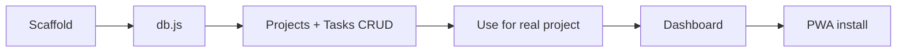

# Tech stack considerations
_Exported on 7/19/2026 at 09:50:25 GMT+7 from Cursor (3.10.20)_

---

**User**

untuk tech stack apa kah ini terlalu overkill atau untuk diawalan kita gunakan vanilla ?

---

**Cursor**

Saya akan cek struktur proyek dan tech stack yang dipakai dulu, supaya rekomendasinya sesuai konteks.


Pertanyaan bagus — dan jawabannya **bukan hitam-putih**. Stack di plan Retraq **sebagian memang overkill untuk awal**, tapi **bukan semuanya**.

## Stack yang sudah direncanakan

| Layer | Pilihan | Status untuk MVP v1 |
|-------|---------|---------------------|
| Frontend | SvelteKit PWA | Opsional di awal |
| Storage | IndexedDB (primary) | **Wajib** |
| Backend | ElysiaJS + Supabase | **Overkill** — sudah ditunda (local-only dulu) |
| Editor | TipTap | **Overkill** untuk MVP Projects |
| AI / pgvector | Ollama, OpenAI, RAG | **Overkill** — v2 |

Plan personal PWA sudah benar: **MVP v1 = local-only IndexedDB**, sync cloud nanti.

---

## Apa yang benar-benar overkill di awal?

**Overkill untuk fase pertama (Projects MVP):**

1. **ElysiaJS + Supabase** — MVP cuma butuh CRUD proyek/task di browser. IndexedDB cukup.
2. **TipTap** — catatan proyek awal cukup `<textarea>` atau markdown sederhana.
3. **AI layer** — auto-tag, RAG, embeddings — jelas bukan v1.
4. **Build pipeline berat** — kalau belum yakin arah produk, setup penuh bisa makan 1 minggu sebelum fitur jalan.

**Tidak overkill:**

- **IndexedDB** — wajib untuk offline PWA.
- **Service Worker + manifest** — wajib supaya installable.
- **Vanilla CSS + design tokens** — sudah dipakai di QC Lab, proven.

---

## Vanilla vs SvelteKit untuk awal?

Kamu sudah punya referensi arsitektur yang jalan di **QC Lab PWA**:

```
Vanilla JS + IndexedDB + hash router + Service Worker
```

Itu **bukan downgrade** — itu pola yang **tepat** untuk MVP personal tool solo dev.

### Mulai vanilla kalau:

- Target: **validasi produk dulu** (apakah benar-benar dipakai tiap hari?)
- Scope MVP: dashboard + CRUD proyek/task + export JSON
- Mau **ship dalam 2–3 minggu**, bukan 4–6 minggu setup
- Sudah nyaman dengan pola QC Lab (`db.js`, router hash, komponen manual)

### Mulai SvelteKit kalau:

- Yakin Retraq akan **besar** (Inbox, Daily Notes, bi-links, search, Review)
- UI akan **banyak state** (tabs, modal, reactive progress bar, filter)
- Mau **refactor lebih sedikit** saat modul Knowledge masuk v1.1+

SvelteKit **bukan overkill** kalau dipakai **tanpa** backend/AI di awal — tapi **lebih berat** dari vanilla untuk MVP pertama.

---

## Rekomendasi praktis

**Hybrid yang paling masuk akal untuk solo dev:**

```
Fase 0–1 (MVP Projects):
├── Vanilla JS + IndexedDB     ← sama seperti QC Lab
├── PWA (sw.js + manifest)
├── CSS variables (dark-first)
└── NO backend, NO TipTap, NO AI

Fase 2 (Knowledge v1.1+):
├── Tetap vanilla ATAU migrasi ke SvelteKit
└── Baru pertimbangkan rich editor (TipTap) kalau Daily Notes butuh

Fase 3+:
├── Supabase sync (opsional)
└── AI (v2, kalau benar-benar dipakai)
```

**Prinsip:** overkill bukan soal vanilla vs framework — overkill = **membangun infra cloud/AI sebelum produk terbukti dipakai**.

---

## Perbandingan singkat

| Aspek | Vanilla (QC Lab pattern) | SvelteKit full stack |
|-------|--------------------------|----------------------|
| Time to first usable app | ~1–2 minggu | ~2–4 minggu |
| Kompleksitas mental | Rendah | Sedang |
| Skala ke 10+ layar | Manual, bisa messy | Lebih rapi |
| Offline PWA | Sama-sama bisa | Sama-sama bisa |
| Risiko abandon project | Lebih rendah | Lebih tinggi (setup fatigue) |

---

## Kesimpulan

Untuk **awal Retraq Personal PWA**, **vanilla + IndexedDB** (mengikuti pola QC Lab) **bukan mundur** — itu **strategi yang tepat** untuk solo dev yang mau validasi dulu.

Yang overkill di awal: **Supabase, Elysia, TipTap, dan AI** — dan plan kamu sudah benar menundanya.

SvelteKit **opsional** di foundation; bisa ditambah nanti saat modul Knowledge (search, bi-links, banyak layar) mulai terasa berat di vanilla.

Kalau mau, kita bisa susun **struktur folder MVP vanilla** (mirror QC Lab) khusus modul Projects Retraq — tanpa backend sama sekali.

---

**User**

oke revisi planning nya 

---

**Cursor**

Saya akan revisi dokumen planning sesuai keputusan vanilla + IndexedDB untuk MVP.


Memperbarui dokumen planning: tech stack vanilla-first, arsitektur, data model, timeline, dan todo.


Planning sudah direvisi di `retraq_personal_pwa_5c82feab.plan.md`. Ringkasan perubahan:

## Perubahan utama

**1. Keputusan tech baru**
- MVP = **Vanilla JS + IndexedDB + PWA** (mengikuti pola QC Lab)
- **Ditunda:** SvelteKit, Supabase, ElysiaJS, TipTap, AI/RAG

**2. Section baru: Ringkasan Revisi Tech**
- Tabel before/after — time to MVP **~4 minggu → ~3 minggu**

**3. Arsitektur**
- Data layer MVP = IndexedDB saja
- Supabase & AI masuk subgraph **Deferred v2+**

**4. Data model**
- **IndexedDB-first** dengan tabel stores + contoh object JS
- SQL hanya referensi untuk sync v2+

**5. Tech stack (Section 6) — rewrite penuh**
- Fase 1: vanilla (MVP)
- Fase 2: Knowledge (marked.js, client search)
- Fase 3: cloud/AI opsional
- **Folder structure** `retraq/` siap scaffold

**6. Timeline**
- Foundation: 1 minggu → **3–4 hari**
- PWA polish: 1 minggu → **3–4 hari**
- Total MVP Projects: **~3 minggu**

**7. Todo baru**
- `scaffold-vanilla` — scaffold kode mengikuti QC Lab

**8. Risiko & acceptance criteria**
- Tambah mitigasi vanilla scale limit, data backup
- Kriteria: tanpa dependency backend/build tool

---

Langkah berikutnya yang paling masuk akal:
1. **Scaffold kode** `retraq/` (index.html, db.js, app.js)
2. **Tulis PRD lengkap** `retraq_personal_pwa_planning.md`

Mau lanjut yang mana dulu?

---

**User**

what best first things to do ?

---

**Cursor**

Based on where you are now — **planning is done, no code yet** — the best order is **build first, document later**. You already have enough direction in the plan file.

## Best first things (in order)

### 1. Scaffold the app shell (Day 1 — ~2–3 hours)
Goal: open `index.html` in browser and see Retraq running.

Create the `retraq/` folder with:
- `index.html` — sidebar + empty main area
- `css/style.css` — dark theme + CSS variables (copy the QC Lab pattern)
- `js/app.js` — hash router (`#/`, `#/projects`, `#/project/:id`)
- `js/components.js` — modal, toast (minimal)

**Done when:** you can click sidebar links and the main view changes.

---

### 2. Build `db.js` first (Day 1–2 — ~3–4 hours)
This is the real foundation. Everything else depends on it.

Implement IndexedDB for MVP stores only:
- `projects`
- `milestones`
- `tasks`
- `activity_log`

Include:
- `openDB()`, CRUD helpers
- `exportJSON()` / `importJSON()` (even a rough version)

**Done when:** in DevTools you can create a project, add tasks, refresh, and data is still there.

---

### 3. Ship one vertical slice (Day 2–3)
Don't build the full app yet. Build **one flow end-to-end**:

```
Create project → open project → add 3 tasks → toggle done → progress updates
```

Pages/modules:
- `projects.js` — list + create
- `project-detail.js` — tasks tab only
- `tasks.js` — add/toggle/delete

**Done when:** you track **one real project of yours** (e.g. Retraq itself) inside the app.

This is the most important step — if this feels useful daily, the product is validated.

---

### 4. Add dashboard (Day 4–5)
Only after step 3 works:
- Active projects (max 5 cards + progress bar)
- Tasks due soon
- Stale projects (7+ days no activity)

**Done when:** opening `#/` immediately tells you what to work on.

---

### 5. PWA polish (Day 6–7)
Add when core CRUD is stable:
- `manifest.json`
- `sw.js` — cache static assets
- Install test on Android + desktop

**Done when:** app installs and works offline.

---

## What NOT to do first

| Skip for now | Why |
|---|---|
| Full PRD rewrite | Plan file is already enough for MVP |
| Update old brain-storming docs | Easy to procrastinate on |
| UI/UX spec polish | Wireframe while coding is faster |
| Milestones module | Tasks alone are enough for week 1 |
| Knowledge / Inbox / Daily Notes | v1.1, not MVP |
| Service Worker on day 1 | IndexedDB matters more first |
| Supabase / SvelteKit / TipTap | Explicitly deferred |

---

## Recommended Week 1 target



**MVP usable in ~1 week** if you focus on: scaffold → db → projects → tasks.

---

## Practical “Day 1 checklist”

1. Create `retraq/` folder in this repo  
2. Copy structure mindset from QC Lab (`app.js`, `db.js`, hash router)  
3. Implement `projects` + `tasks` in IndexedDB  
4. Build create project + task list UI  
5. Track Retraq as your first project inside the app  

---

## My recommendation

**Start with #2 (`db.js`) + #3 (projects/tasks CRUD)** — not PRD writing.

You learn more in 1 day of working code than 1 week of planning docs. PRD can be extracted from the plan **after** the vertical slice works.

If you want, I can scaffold `retraq/` (shell + `db.js` + minimal projects UI) as the next step.

---

**User**

lets do your  recommendation

---

**Cursor**

Memulai scaffold `retraq/`: shell, `db.js`, dan UI projects/tasks minimal.


---

**User**

oke continue

oke continue bro

---

**Cursor**

Melanjutkan: cek status scaffold, verifikasi app jalan, lalu lengkapi bagian yang masih kurang.


Melanjutkan polish MVP: milestone CRUD, due date/priority pada task, overdue di dashboard, dan verifikasi app.


Scaffold selesai dan sudah dipoles. Retraq MVP siap dipakai.

## Yang sudah jalan

**Core (vertical slice):**
- Create project (dengan template + auto milestones)
- Project detail → tasks (add, toggle, delete)
- Progress bar (tasks + milestones)
- Dashboard: active projects, overdue, due soon, stale projects
- Export/import JSON backup
- PWA shell (manifest + service worker)

**Polish baru:**
- Milestones: add, toggle complete, delete
- Tasks: priority + due date saat create
- Overdue tasks di dashboard (highlight merah)
- Keyboard shortcut `N` → new project
- Header title menampilkan nama proyek

## Cara coba

Dev server sudah jalan di:

**http://localhost:8765**

Kalau belum kebuka, jalankan manual:

```powershell
Set-Location "c:\Users\ajiwi\Project\Project-Second-Brain-and-Projec-Management\retraq"
python -m http.server 8765
```

Lalu buka browser → **http://localhost:8765**

## Quick test flow

1. Tekan `N` atau klik **+ New Project**
2. Pilih template **Side Project** → title: `Retraq Personal PWA`
3. Buka project → tambah 3–5 tasks (coba set due date)
4. Tab **Milestones** → centang milestone yang selesai
5. Kembali ke **Dashboard** → lihat progress & overdue
6. **Settings** → export JSON backup

## Struktur file

```
retraq/
├── index.html
├── manifest.json, sw.js
├── css/style.css
├── js/
│   ├── db.js          ← IndexedDB layer
│   ├── app.js         ← router
│   ├── dashboard.js
│   ├── projects.js
│   ├── project-detail.js
│   └── tasks.js
└── assets/icons/icon.svg
```

## Next steps (opsional)

1. **Dogfood** — pakai Retraq untuk track proyek Retraq sendiri selama 1 minggu
2. **Deploy** — GitHub Pages / Cloudflare Pages (static)
3. **v1.1** — modul Knowledge (Inbox, Daily Notes, search)

Mau lanjut deploy ke GitHub Pages, atau langsung mulai modul Knowledge?

---

**User**

<system_notification>
The following task has finished. If you were already aware, ignore this notification and do not restate prior responses.

<task>
kind: shell
status: error
task_id: 578653
title: Start local HTTP server for Retraq
tool_call_id: tool_2f41655a-c4bd-40a3-b88b-05574e4f393
detail: exit_code=1
output_path: C:\Users\ajiwi\.cursor\projects\c-Users-ajiwi-Project-Project-Second-Brain-and-Projec-Management\terminals\578653.txt
</task>
</system_notification>
<user_query>Briefly inform the user about the task result and perform any follow-up actions (if needed). If there's no follow-ups needed, don't explicitly say that.</user_query>

---

**Cursor**

Server pertama gagal karena PowerShell tidak mendukung `&&` sebagai pemisah perintah.

Sudah dijalankan ulang dengan sintaks yang benar — server Retraq **aktif** di **http://localhost:8765**. Buka URL itu di browser untuk mulai pakai app.

---

**User**

<system_notification>
The following task has finished. If you were already aware, ignore this notification and do not restate prior responses.

<task>
kind: shell
status: success
task_id: 578655
title: Verify Retraq server responds
tool_call_id: tool_d1292c8e-07ab-442c-a3c2-9e177d3454a
output_path: C:\Users\ajiwi\.cursor\projects\c-Users-ajiwi-Project-Project-Second-Brain-and-Projec-Management\terminals\578655.txt
</task>
</system_notification>
<user_query>Briefly inform the user about the task result and perform any follow-up actions (if needed). If there's no follow-ups needed, don't explicitly say that.</user_query>

---

**Cursor**

Verifikasi server Retraq berhasil — `index.html` merespons **HTTP 200**. App siap di **http://localhost:8765**.

---

**User**

start knowledge modul

---

**Cursor**

Memulai modul Knowledge v1.1: cek struktur app dan plan, lalu implement Inbox, Daily Notes, search, dan link ke proyek.


---

**User**

continue

---

**Cursor**

Memeriksa state file saat ini, lalu melanjutkan modul Knowledge.


`db.js` sudah lengkap. Saya lanjut buat modul UI dan wiring.


Modul **Knowledge v1.1** sudah live. Ringkasan:

## Yang baru

| Fitur | Route | Shortcut |
|-------|-------|----------|
| **Quick Capture → Inbox** | FAB (+) atau `#/inbox` | `C` |
| **Inbox processing** | `#/inbox` | Process → jadi note + tags + link project |
| **Daily Notes** | `#/daily` / `#/daily/2026-07-19` | Auto-save |
| **Global Search** | `#/search` | Projects, tasks, notes |
| **Project Notes tab** | Project detail → Notes | Add/link catatan ke proyek |
| **Tags** | Di note editor | Comma-separated |
| **Inbox badge** | Sidebar + dashboard widget | Count unprocessed |

## Data layer (IndexedDB v2)

Stores baru: `notes`, `tags`, `note_tags`, `project_notes`

Note types: `idea`, `note`, `til`, `snippet`, `daily`

## File baru

- `js/notes.js` — editor & note cards
- `js/capture.js` — FAB quick capture
- `js/inbox.js`, `js/daily-notes.js`, `js/search.js`

## Coba sekarang

**http://localhost:8765**

1. Tekan `C` → capture ide ke Inbox  
2. Buka **Inbox** → **Process** → set type, tags, link ke project  
3. Buka **Daily Notes** → tulis journal hari ini (auto-save)  
4. **Search** → cari lintas projects/tasks/notes  
5. Project detail → tab **Notes** → add catatan ter-link  

> **Note:** DB upgrade ke v2 otomatis. Kalau app aneh setelah update, hard refresh (`Ctrl+Shift+R`) supaya service worker v2 ke-load.

Langkah berikutnya (v1.2): bi-directional links, Reference Library, PARA-lite. Mau lanjut ke situ?

---

**User**

apakah pwa ini mobile friendly ?

---

**Cursor**

Saya cek layout dan CSS responsif di codebase dulu, supaya jawabannya akurat.


**Ya, cukup mobile friendly untuk dipakai** — tapi belum di level “native app polish”. Lebih tepat: **mobile-usable**, bukan **mobile-first**.

## Yang sudah mendukung mobile

| Aspek | Status |
|-------|--------|
| Viewport meta | ✅ `width=device-width` |
| PWA installable | ✅ `manifest.json` + service worker |
| iOS home screen | ✅ `apple-mobile-web-app-*` meta |
| Layout responsif | ✅ Breakpoint `@media (max-width: 768px)` |
| Navigasi mobile | ✅ Sidebar collapse + tombol ☰ hamburger |
| Quick capture | ✅ FAB (+) — bagus untuk jempol |
| Form & grid | ✅ 2-kolom jadi 1-kolom di HP |
| Daily Notes | ✅ Layout stack vertikal di mobile |
| Offline | ✅ IndexedDB — jalan di browser HP |

## Yang masih kurang / bisa lebih baik

1. **Desktop-first, bukan mobile-first** — sidebar + topbar, bukan bottom nav seperti QC Lab (lebih nyaman di HP).
2. **Shortcut keyboard (`N`, `C`)** — di mobile kurang relevan (FAB sudah menggantikan capture).
3. **Touch target** — checkbox task & beberapa tombol kecil (~1rem), idealnya min **44×44px** untuk jari.
4. **Sidebar overlay** — belum ada backdrop gelap + tap outside untuk tutup menu.
5. **Safe area** — belum handle notch iPhone (`env(safe-area-inset-*)`).
6. **Icon PWA** — cuma SVG; Android install lebih reliable dengan PNG **192px + 512px**.
7. **Manifest** — `orientation: portrait-primary` — tablet landscape bisa terasa sempit.

## Verdict

| Use case | Rating |
|----------|--------|
| Buka di browser HP, tracking project + capture | ✅ **Cukup baik** |
| Install PWA, dipakai daily di HP | ✅ **Bisa**, dengan minor friction |
| UX setara app native / Notion mobile | ❌ **Belum** |

## Rekomendasi cepat (kalau mau polish mobile)

Prioritas tinggi:
1. Bottom nav (Dashboard · Projects · Inbox · Capture · Search)
2. Touch target lebih besar (min 44px)
3. PNG icons 192/512 untuk PWA
4. Safe-area padding untuk iPhone

**Kesimpulan:** Retraq **bisa dipakai di HP** untuk MVP — capture, inbox, daily notes, tasks semua jalan. Tapi kalau target utama pemakaian di **Android/iPhone daily**, worth invest **1–2 hari** polish mobile UX.

Mau saya kerjakan polish mobile-nya sekarang?

---

**User**

Langkah berikutnya (v1.2): bi-directional links, Reference Library, PARA-lite

continue

