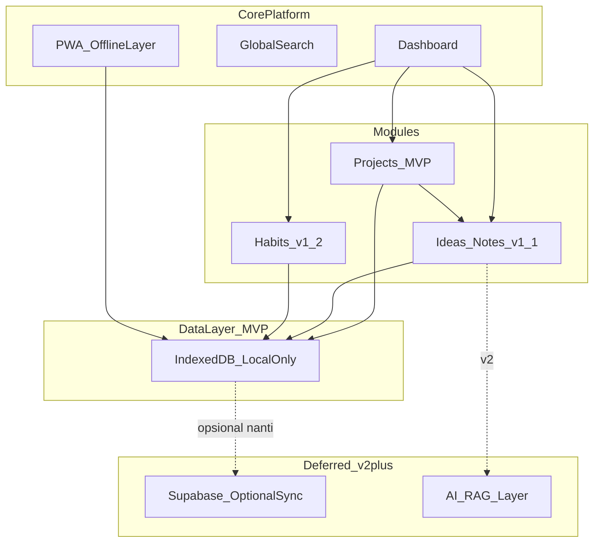
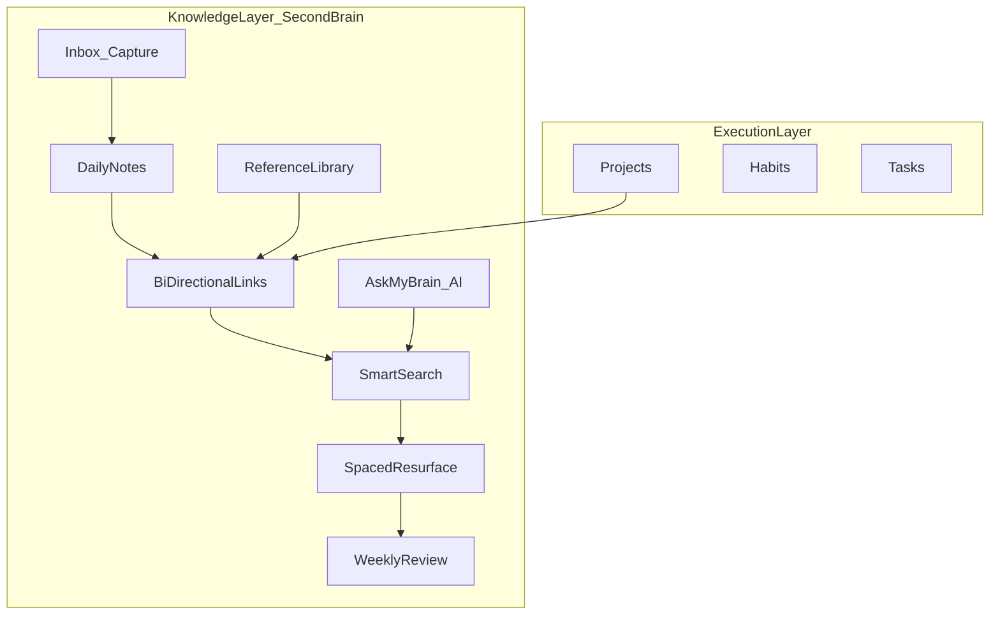
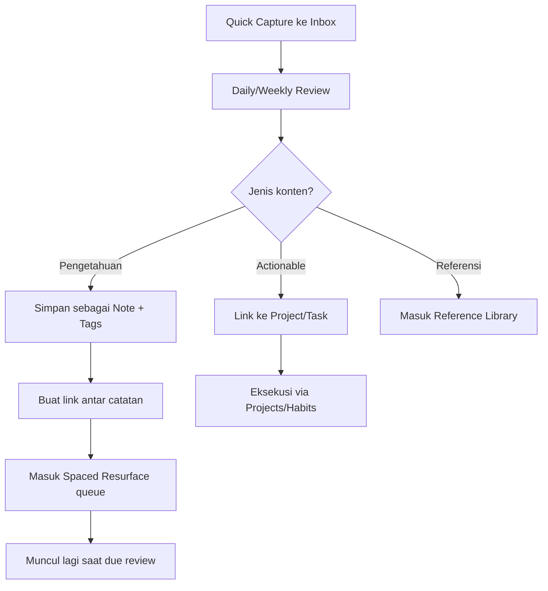
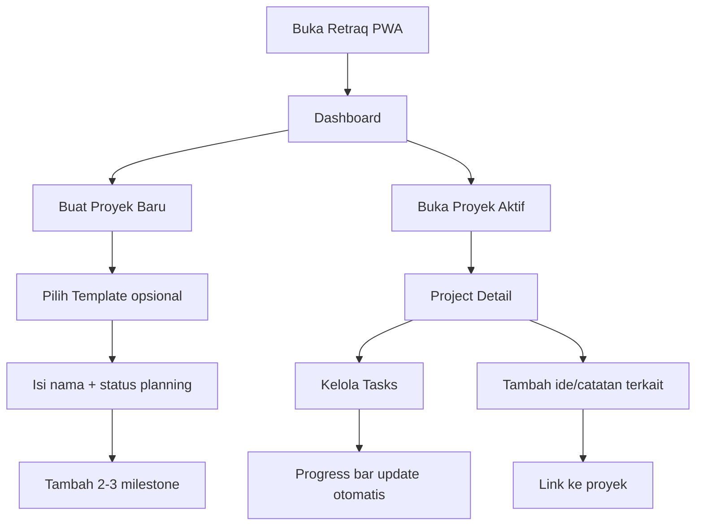
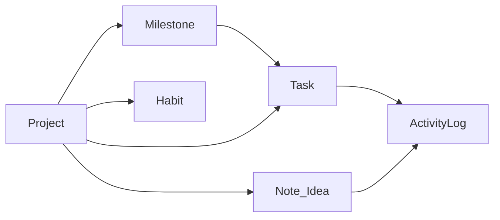

# Retraq Personal PWA — Brainstorming & Planning Plan

## Konteks & Keputusan

Anda sudah punya fondasi riset dan planning di workspace ini:

| Dokumen                                                                                              | Relevansi                                                             |
| ---------------------------------------------------------------------------------------------------- | --------------------------------------------------------------------- |
| [riset_second_brain_app.md](c:\Users\ajiwi\Project\brain-storming\riset_second_brain_app.md)         | Pain points PKM, local-first, output-first philosophy                 |
| [retraq_prd_planning.md](c:\Users\ajiwi\Project\brain-storming\retraq_prd_planning.md)               | PRD lama (SvelteKit stack) — **partially superseded**, lihat keputusan tech di bawah |
| [retraq_implementation_plan.md](c:\Users\ajiwi\Project\brain-storming\retraq_implementation_plan.md) | Task breakdown solo dev — perlu update ke vanilla-first              |
| [qc_lab_pwa_planning.md](c:\Users\ajiwi\Project\brain-storming\qc_lab_pwa_planning.md)               | **Referensi arsitektur utama** — Vanilla JS + IndexedDB + PWA       |
| [from_idea_to_product.md](c:\Users\ajiwi\Project\brain-storming\from_idea_to_product.md)             | Framework Fase 0–2 yang akan diisi                                    |

**Keputusan Anda:**

- Perluas **Retraq** (bukan produk baru terpisah)
- **MVP v1 = modul Proyek Pribadi** dulu, baru ide/catatan dan habit
- **Tech MVP = Vanilla JS + IndexedDB** (mengikuti pola QC Lab) — tanpa backend, tanpa framework
- **Ditunda ke fase lanjut:** SvelteKit, Supabase, ElysiaJS, TipTap, AI/RAG

### Ringkasan Revisi Tech (Jul 2026)

| Aspek | Sebelum | Sesudah |
| ----- | ------- | ------- |
| Frontend MVP | SvelteKit PWA | **Vanilla JS** (pola QC Lab) |
| Data MVP | IndexedDB + Supabase | **IndexedDB saja** |
| Backend MVP | ElysiaJS (opsional) | **Tidak ada** |
| Editor MVP | TipTap | **textarea / plain text** |
| Time to MVP | ~4 minggu | **~3 minggu** |
| Framework migration | — | Evaluasi SvelteKit **setelah v1.2** jika perlu |

---

## 1. Repositioning Product Vision

Ubah positioning dari "second brain untuk developer" menjadi **personal command center**:

```
Untuk SAYA yang punya banyak ide, proyek pribadi, dan rutinitas
tapi semuanya tersebar di notes, spreadsheet, dan ingatan,

RETRAQ adalah PWA personal yang menggabungkan
PROYEK + IDE + HABIT dalam satu tempat yang offline-first.

Tidak seperti Notion (terlalu generic & setup-heavy),
Obsidian (terlalu teknis), atau 3 app terpisah,
Retraq langsung usable — mulai dari tracking proyek,
bukan dari membangun sistem.
```

**Prinsip desain** (dari riset, disesuaikan personal):

- **Output-first**: proyek punya status & progress nyata, bukan hanya catatan
- **Zero-setup**: template proyek siap pakai (Side Project, Belajar, QC Lab, dll)
- **Capture cepat**: ide bisa di-link ke proyek tanpa friction
- **Local-first**: data di device dulu (IndexedDB), sync cloud opsional nanti

---

## 2. Arsitektur Modul (Unified PWA)



**Hubungan antar modul (kunci diferensiasi):**

- Setiap **proyek** punya: milestones, tasks, linked notes/ideas, activity log
- **Ide** bisa "floating" atau langsung di-assign ke proyek
- **Habit** (v1.2) bisa di-link ke proyek (mis. "coding 30 menit" → proyek Retraq)

**Dua lapisan produk (penting untuk nama "Second Brain"):**

| Lapisan | Fungsi | Modul |
|---------|--------|-------|
| **Execution** | Menggerakkan hidup & proyek | Projects, Habits, Tasks |
| **Knowledge** | Mengingat, menghubungkan, menampilkan kembali | Inbox, Notes, Links, Review, Search |

Tanpa lapisan Knowledge, Retraq hanya personal PM app — bukan second brain. Proyek tetap MVP v1, tapi modul Knowledge harus masuk v1.1–v1.3 agar nama produk konsisten.

---

## 3. Modul MVP: Proyek Pribadi (v1.0)

### Problem yang diselesaikan

| Pain                                      | Solusi Retraq                                        |
| ----------------------------------------- | ---------------------------------------------------- |
| Proyek pribadi "nggak jelas progress-nya" | Status + milestone + % completion                    |
| Ide proyek menumpuk tanpa eksekusi        | Dashboard "Active Projects" + next action            |
| Context hilang antar sesi kerja           | Project detail: tasks + linked notes + log aktivitas |
| Butuh buka banyak app                     | Satu PWA di HP & laptop                              |

### Fitur MoSCoW — MVP v1.0 (Projects First)

**Must Have**

- CRUD proyek: nama, deskripsi singkat, status, deadline opsional, cover color/icon
- Status proyek: `idea` → `planning` → `active` → `paused` → `done` → `archived`
- Milestones per proyek (checkpoint sederhana, bukan Gantt penuh)
- Tasks per proyek: title, done/undone, due date opsional, priority (low/med/high)
- Progress otomatis: `% tasks done` + milestone completion
- Dashboard: active projects, overdue tasks, proyek tanpa aktivitas 7+ hari
- Project detail page: overview + tabs (Tasks, Milestones, Activity) — tab Notes placeholder sampai v1.1
- PWA installable + offline read/write via IndexedDB
- Export/import data JSON (backup manual)

**Should Have (v1.1 — Ideas module)**

- Quick capture ide (teks singkat, 1 tap dari dashboard)
- Note/idea types: `idea`, `note`, `til`, `snippet` (pertahankan dari PRD lama)
- Link note ↔ project (many-to-many)
- Full-text search lintas proyek + catatan
- Tag sederhana (manual dulu, AI auto-tag ditunda)

**Could Have (v1.2 — Habits)**

- Habit definition: nama, frekuensi (daily/weekly), target streak
- Daily check-in + calendar heatmap
- Statistik streak & completion rate
- Link habit ke proyek (opsional)

**Won't Have (eksplisit ditolak v1)**

- Kolaborasi tim / sharing
- Kanban board kompleks / sprint planning
- Calendar sync eksternal
- Native mobile app

---

## 3B. Fitur Second Brain — Rekomendasi Tambahan

> **Inti konsep "Second Brain"** (dari [riset_second_brain_app.md](c:\Users\ajiwi\Project\brain-storming\riset_second_brain_app.md)): bukan gudang catatan, tapi sistem yang **mengingatkan, menghubungkan, dan menampilkan kembali** pengetahuan tepat saat dibutuhkan. Proyek & habit = eksekusi; fitur di bawah = memori.

### Peta Fitur vs Nama "Second Brain"



### Tier 1 — Wajib agar layak disebut Second Brain (v1.1–v1.3)

| # | Fitur | Mengapa "Second Brain"? | Versi |
|---|-------|------------------------|-------|
| 1 | **Inbox / Quick Capture** | Otak menangkap dulu, mengolah belakangan — friction < 5 detik dari HP | v1.1 |
| 2 | **Daily Notes** | Anchor temporal: "Apa yang saya pikirkan hari ini?" — fondasi PKM (Obsidian, Logseq) | v1.1 |
| 3 | **Bi-directional Links** | `[[catatan A]]` ↔ backlinks — koneksi antar ide, bukan folder datar | v1.2 |
| 4 | **Global Search** | "Saya tahu pernah catat ini, tapi di mana?" — retrieval = fungsi otak | v1.1 |
| 5 | **Link Note ↔ Project/Task** | Action-linked notes — catatan jadi actionable, bukan kuburan | v1.1 |
| 6 | **Tags + Areas (PARA-lite)** | Organisasi: **Projects** (deadline), **Areas** (ongoing, mis. Kesehatan, Belajar), **Resources** (referensi), **Archive** | v1.2 |
| 7 | **Reference Library** | Simpan link/artikel/bookmark + catatan singkat — sumber eksternal masuk otak | v1.2 |

### Tier 2 — Second Brain "Aktif" (bukan gudang pasif) (v1.3–v2)

| # | Fitur | Mengapa "Second Brain"? | Versi |
|---|-------|------------------------|-------|
| 8 | **Spaced Resurface** | Catatan/ide lama muncul kembali untuk review — anti digital graveyard | v1.3 |
| 9 | **Weekly Review Ritual** | Checklist guided: inbox kosong, proyek aktif, catatan minggu ini — output-first | v1.3 |
| 10 | **Random Note / Serendipity** | "Ingat lagi" — tampilkan catatan lama yang relevan dengan proyek aktif | v1.3 |
| 11 | **Connection Suggestor** | "Catatan A & B mungkin berhubungan" — synthesis antar ide | v2 |
| 12 | **Ask My Brain (RAG)** | Tanya otak digital: jawaban dari knowledge base sendiri | v2 |
| 13 | **Weekly Digest** | Ringkasan otomatis: apa yang dicatat, koneksi baru, proyek stale | v2 |

### Tier 3 — Nice-to-Have (v2+)

| Fitur | Catatan |
|-------|---------|
| Knowledge Graph View | Visualisasi link — keren tapi jarang dipakai daily; tunda |
| Web Clipper (browser ext) | Capture dari web; effort tinggi, bisa manual dulu via Reference Library |
| Contradiction Detector | AI temukan catatan bertentangan — premium, bukan core |
| Templates berpikir | TIL, Decision Log, Post-Mortem, Book Notes — mulai dengan 3 template |
| Markdown export/import | Data ownership, migrasi ke/dari Obsidian |
| Voice capture | Quick note via suara — mobile-friendly |

### Fitur yang SUDAH ada di plan & sudah selaras

- Quick capture ide → **Inbox**
- Note types (idea, note, til, snippet) → **Knowledge types**
- Full-text search → **Global Search**
- Link note ↔ project → **Action-linked notes**
- Stale projects alert → sebagian **Weekly Review**
- Export JSON → **Data ownership**

### Fitur yang BELUM ada & paling krusial untuk nama "Second Brain"

Prioritas tambahan setelah Projects MVP:

1. **Daily Notes** — tanpa ini, tidak ada "ingatan harian"
2. **Bi-directional Links** — tanpa ini, tidak ada "jaringan pengetahuan"
3. **Spaced Resurface** — diferensiator utama vs Notion/Notes biasa
4. **Weekly Review** — memaksa synthesis, bukan hoarding
5. **PARA-lite (Areas + Resources)** — struktur otak digital yang proven

### MoSCoW Revised — Modul Knowledge (v1.1–v1.3)

**Must Have (v1.1 — segera setelah Projects MVP)**
- Inbox + Quick Capture (FAB, keyboard shortcut)
- Daily Notes (auto-create per hari)
- Global search (full-text, lintas proyek + catatan)
- Link note ↔ project/task
- Tag manual

**Should Have (v1.2)**
- Bi-directional links + backlinks panel
- Reference Library (URL + title + notes)
- PARA-lite: Areas & Resources (Projects sudah ada)
- Note templates: Idea, TIL, Decision Log

**Should Have (v1.3 — "Active Brain")**
- Spaced resurface queue (catatan due for review)
- Weekly Review guided flow (15 menit)
- "On this day" / memory lane
- Random resurface saat buka dashboard

**Could Have (v2)**
- Ask My Brain (RAG, butuh AI layer)
- Connection suggestor
- Weekly digest (AI)
- Knowledge graph view

**Won't Have**
- Full Zettelkasten complexity (UID, permanent notes terpisah)
- Roam-style block outliner
- Real-time collaboration

### Sidebar Navigation (Revised)

```
Dashboard
Projects
Inbox           ← v1.1 (unprocessed captures)
Daily Notes     ← v1.1
Library           ← v1.2 (references/bookmarks)
Areas             ← v1.2 (PARA)
Habits            ← v1.2
Search
Review            ← v1.3 (weekly + resurface queue)
Settings
```

### User Flow Second Brain



### User Flow Utama



### Template Proyek (Zero-Setup)

| Template      | Milestone default                 | Use case            |
| ------------- | --------------------------------- | ------------------- |
| Side Project  | Research → MVP → Launch → Iterate | Retraq, app pribadi |
| Learning      | Goal → Study → Practice → Review  | Belajar skill baru  |
| Personal Goal | Plan → Execute → Measure → Done   | Target non-teknis   |
| Blank         | (kosong)                          | Fleksibel           |

---

## 4. Data Model (IndexedDB-First)

> **Keputusan revisi:** Schema MVP didefinisikan di **IndexedDB** (bukan PostgreSQL). SQL schema dari PRD lama tetap berguna sebagai referensi **jika** cloud sync ditambahkan di v2+.

### IndexedDB Database: `RetraqDB`

Pola dari [qc_lab_pwa_planning.md](c:\Users\ajiwi\Project\brain-storming\qc_lab_pwa_planning.md) — satu `db.js` central, CRUD per store.

**Stores MVP v1.0:**

| Store | Key | Index | Fields utama |
| ----- | --- | ----- | ------------ |
| `projects` | `id` (UUID) | `status`, `last_activity_at` | title, description, status, color, icon, target_date, created_at, updated_at, last_activity_at |
| `milestones` | `id` | `project_id` | project_id, title, due_date, is_completed, sort_order |
| `tasks` | `id` | `project_id`, `milestone_id`, `is_done` | project_id, milestone_id, title, is_done, priority, due_date, sort_order |
| `activity_log` | `id` | `project_id`, `created_at` | project_id, entity_type, entity_id, action, created_at |

**Stores v1.1+ (Knowledge):** `notes`, `project_notes`, `tags`, `note_tags`, `inbox`

**Stores v1.2+:** `habits`, `habit_logs`, `areas`, `references`

**Stores v2+ (sync opsional):** `sync_queue`, `sync_meta`

### Contoh object shape (JavaScript)

```javascript
// projects store
{
  id: "uuid-v4",
  title: "Retraq Personal PWA",
  description: "Tracking proyek pribadi",
  status: "active", // idea | planning | active | paused | done | archived
  color: "#6366f1",
  icon: "🚀",
  target_date: "2026-08-01", // ISO date string, nullable
  created_at: "2026-07-19T00:00:00.000Z",
  updated_at: "2026-07-19T00:00:00.000Z",
  last_activity_at: "2026-07-19T00:00:00.000Z"
}

// tasks store
{
  id: "uuid-v4",
  project_id: "uuid-v4",
  milestone_id: "uuid-v4", // nullable
  title: "Setup IndexedDB module",
  is_done: false,
  priority: "high", // low | medium | high
  due_date: null,
  sort_order: 0
}
```

### SQL schema (referensi v2+ sync saja)

Schema PostgreSQL dari PRD lama tetap valid sebagai target sync — **bukan blocker MVP**:

```sql
-- Referensi v2+ — jangan setup di MVP
CREATE TABLE projects (...);
CREATE TABLE milestones (...);
CREATE TABLE tasks (...);
CREATE TABLE project_notes (...);
```

**Export/Import:** JSON flat file (semua stores) — backup manual, migrasi antar device tanpa cloud.

---

## 5. UI/UX — Perubahan dari Spec Lama

File [uiux_design_spec.md](c:\Users\ajiwi\Project\brain-storming\uiux_design_spec.md) perlu di-update:

**Sidebar navigation baru:**

```
Dashboard
Projects        ← default landing MVP
Ideas           ← v1.1
Habits          ← v1.2
Search
Settings
```

**Dashboard layout (MVP):**

- Hero: "Active Projects" (max 3-5 kartu dengan progress bar)
- Section: "Tasks due soon"
- Section: "Stale projects" (no activity 7+ days — anti-graveyard)
- FAB: `+ New Project` / `+ Quick Idea` (v1.1)

Tetap dark-first, design tokens existing — cukup tambah semantic colors untuk project status.

---

## 6. Tech Stack (Revised — Vanilla-First, Phased)

### Fase 1 — MVP v1.0 (Projects) ✅ Mulai di sini

| Layer | Teknologi | Alasan |
| ----- | --------- | ------ |
| **Structure** | HTML5 | App shell sederhana, universal |
| **Logic** | Vanilla JavaScript (ES6+) | Pola proven QC Lab, tanpa build step |
| **Routing** | Hash-based SPA (`#/projects`, `#/project/:id`) | Cukup untuk multi-page, offline-friendly |
| **Styling** | Vanilla CSS + CSS Variables | Dark-first, full control, no dependency |
| **Storage** | IndexedDB | Local-first, offline read/write, kapasitas besar |
| **PWA** | Service Worker + manifest.json | Installable di Android & desktop |
| **Hosting** | GitHub Pages / Cloudflare Pages | Static deploy, gratis |
| **Editor notes** | `<textarea>` / plain text | Cukup untuk MVP; TipTap ditunda ke v1.1+ |

**Eksplisit TIDAK dipakai di MVP:**

- ❌ SvelteKit / React / Vue
- ❌ ElysiaJS / backend API
- ❌ Supabase / PostgreSQL
- ❌ TipTap / CodeMirror
- ❌ AI / Ollama / OpenAI / pgvector

### Fase 2 — Knowledge v1.1–v1.3

| Tambahan | Kapan | Catatan |
| -------- | ----- | ------- |
| Markdown rendering (marked.js atau serupa) | v1.1 | Daily Notes, bukan rich editor penuh |
| Client-side full-text search (filter + index) | v1.1 | Tanpa backend |
| Bi-directional link parser | v1.2 | Regex `[[note]]`, backlinks di IndexedDB |
| Export Markdown per note | v1.2 | Data ownership |

**Trigger migrasi ke SvelteKit (opsional):** jika vanilla mulai messy (>15 layar, state kompleks) — **bukan wajib**, evaluasi setelah v1.2.

### Fase 3 — v2+ (Opsional, hanya jika dibutuhkan)

| Layer | Teknologi | Trigger |
| ----- | --------- | ------- |
| Cloud sync | Supabase PostgreSQL | Butuh sync multi-device |
| Backend | ElysiaJS on Bun | Butuh server-side logic |
| Rich editor | TipTap | Butuh formatting kompleks |
| AI | Ollama + OpenAI RAG | Fitur Ask My Brain terbukti dipakai |

### Folder Structure (MVP)

```
retraq/
├── index.html              # App shell + sidebar
├── manifest.json           # PWA manifest
├── sw.js                   # Service Worker (cache + offline)
├── css/
│   └── style.css           # Design tokens + components
├── js/
│   ├── app.js              # Router hash, init, global state
│   ├── db.js               # IndexedDB: open, CRUD, export/import
│   ├── dashboard.js        # Dashboard view
│   ├── projects.js         # Project list + CRUD
│   ├── project-detail.js   # Detail tabs: overview, tasks, milestones
│   ├── tasks.js            # Task CRUD + toggle done
│   ├── milestones.js       # Milestone CRUD
│   └── components.js       # Modal, toast, tabs (reusable)
└── assets/
    └── icons/              # PWA icons
```

**Keputusan MVP:** **100% client-side, local-only** — ship cepat, validasi produk dulu, infra cloud/AI hanya kalau benar-benar dibutuhkan.

---

## 7. Timeline Realistis (Solo, Vanilla-First)

Asumsi 15–20 jam/minggu. Timeline **lebih cepat** di foundation karena tanpa setup SvelteKit/Supabase:

| Fase | Durasi | Deliverable |
| ---- | ------ | ----------- |
| **Brainstorming + PRD** | 3–5 hari | Dokumen `retraq_personal_pwa_planning.md` |
| **Foundation** | **3–4 hari** | Scaffold vanilla + IndexedDB (`db.js`) + design system + sidebar + hash router |
| **Projects MVP** | **2 minggu** | CRUD proyek, tasks, milestones, dashboard, project detail |
| **PWA + Polish** | **3–4 hari** | Service worker, installable, export/import JSON |
| **Knowledge v1.1** | 2 minggu | Inbox, Daily Notes, client search, link ke proyek |
| **Knowledge v1.2** | 2 minggu | Bi-links, Reference Library, PARA-lite, templates |
| **Habits module** | 1 minggu | Check-in + streak + dashboard widget |
| **Active Brain v1.3** | 1–2 minggu | Spaced resurface, Weekly Review, memory lane |
| **AI + Cloud v2** | 3–4 minggu | **Hanya jika MVP terbukti dipakai** — Supabase sync, Ask My Brain |

**Total ke MVP Projects usable:** ~**3 minggu** (vs ~4 minggu dengan SvelteKit stack).

**Total ke "Second Brain" yang layak nama:** ~**10–12 minggu** (Projects ~3 minggu + Knowledge ~6 minggu + Habits ~1 minggu).

---

## 8. Deliverable Brainstorming (Dokumen yang Akan Dibuat)

Setelah plan disetujui, buat/update file di [brain-storming](c:\Users\ajiwi\Project\brain-storming):

1. **`retraq_personal_pwa_planning.md`** (baru, PRD utama)
   - Product vision personal
   - Persona: "Aji — Personal Builder"
   - MoSCoW per modul (Projects / Knowledge Layer / Habits / Active Brain)
   - Section khusus: Fitur Second Brain (Tier 1–3)
   - User stories & flows
   - **IndexedDB schema lengkap** (bukan SQL-first)
   - MVP acceptance criteria
   - Tech stack phased (vanilla → optional SvelteKit → optional cloud/AI)

2. **Update `retraq_prd_planning.md`**
   - Tambah banner: "Superseded partially by personal PWA PRD"
   - Stack lama (SvelteKit + Supabase) → **Fase 3 v2+**, bukan MVP
   - Developer-specific features (code editor, TIL) → modul Ideas, bukan core

3. **Update `uiux_design_spec.md`**
   - Navigation, dashboard, project detail screens
   - Wireframe ASCII/Mermaid untuk 4 layar utama

4. **Update `retraq_implementation_plan.md`**
   - Sprint 0: scaffold vanilla (mirror QC Lab structure)
   - Reorder sprint: Projects → Knowledge → Habits
   - Hapus task Supabase/Elysia dari sprint MVP
   - IndexedDB-first tasks per modul

5. **Scaffold kode `retraq/`** (repo implementasi)
   - `index.html`, `sw.js`, `manifest.json`
   - `js/db.js` dengan stores MVP
   - `js/app.js` hash router + sidebar shell

---

## 9. Acceptance Criteria MVP v1 (Projects)

Aplikasi dianggap siap dipakai personal jika:

- [ ] Bisa install PWA di Android & desktop (tanpa server/backend)
- [ ] Buat proyek + 5 tasks + 2 milestones tanpa internet
- [ ] Dashboard menampilkan progress & next actions
- [ ] Data persist setelah refresh / restart browser (IndexedDB)
- [ ] Export/import JSON backup works
- [ ] Buka project detail < 2 detik di HP
- [ ] **Tidak ada dependency** ke Supabase, API, atau build tool wajib

---

## 10. Risiko & Mitigasi

| Risiko | Mitigasi |
| ------ | -------- |
| Scope creep (Notion clone) | MoSCoW ketat; task list sederhana, bukan full PM |
| Retraq jadi terlalu generic | Link everything ke **project** sebagai backbone |
| Solo dev overload | Vanilla MVP, **zero backend setup**, tunda AI & cloud sync |
| Vanilla JS scale limit | Evaluasi migrasi SvelteKit setelah v1.2 jika UI messy |
| Setup fatigue (stack lama) | **Sudah mitigasi** — drop SvelteKit/Supabase dari MVP |
| Feature overlap dengan QC Lab PWA | QC Lab = domain spesifik kerja; Retraq = personal life/projects |
| Data hilang (local-only) | Export/import JSON wajib di MVP; reminder backup di Settings |

---

## Diagram: Information Architecture


